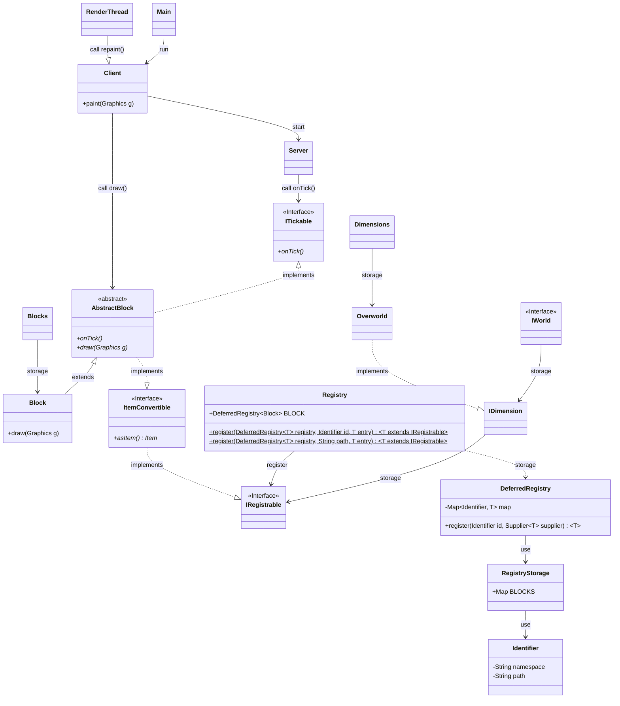

<!---->

# Minecraft 2D

Welcome to Minecraft 2D. This is a sandplay. **(Not sandbox game!!!)**  
欢迎来到Minecraft 2D的世界！这是一个**沙盘**游戏。**（不是沙盒游戏！！！）**

## 初代设计图（结构树） Primary design drawing (structure tree)
| Type  | Description  |
| ----- | ------------ |
| <\|-- | 继承         |
| \*--   | 组成         |
| o--   | 聚合         |
| -->   | 合作         |
| --    | 连接（实线） |
| ..>   | 依赖         |
| ..\|> | 实现         |
| ..    | 连接（虚线） |

## 贡献 Contributing
此项目仍处于初始阶段。我们希望您能为我们做出贡献，哪怕只是1个issue或1个PR。

See [CONTRIBUTING.md](CONTRIBUTING.md)

> Here is the Contribute Value Table.

## 其它 Other
<iframe src="https://discord.com/widget?id=751804389718753421&theme=dark" width="350" height="500" allowtransparency="true" frameborder="0" sandbox="allow-popups allow-popups-to-escape-sandbox allow-same-origin allow-scripts"></iframe>

Join our Discord channel just time! 

现在就加入我们的QQ<s>吹水</s>群！

