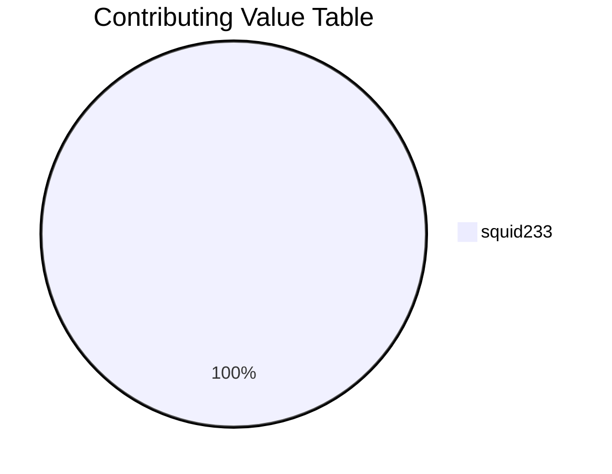

# Minecraft 2D


Welcome to Minecraft 2D. This is a sandplay. **(Not sandbox game!!!)**  
欢迎来到Minecraft 2D的世界！这是一个**沙盘**游戏。**（不是沙盒游戏！！！）**

This game is published on [itch.io](https://squid233.itch.io/minecraft2d), too.

## 运行时环境 Runtime Environment
JRE 11  
最低要求JRE11，低于此版本会导致不能正常启动

## 展示图 Exhibition
200926-pa-build.0  


## 使用方法 Use Guide
1. go [here](/archives) or [Releases](https://github.com/Over-Run/Minecraft2D/releases) to download。  
首先，到[此处](/archives)或 [Releases](https://github.com/Over-Run/Minecraft2D/releases) 下载。
2. Unzip to any directories.  
将其解压到任意文件夹下。
3. Write a startup script and put in your directory.  
编写一个启动脚本并放到文件夹下。

### The startup script
```batch
@echo off
java -jar *.jar
pause
```

## 贡献 Contributing
此项目仍处于初始阶段。我们希望您能为我们做出贡献，哪怕只是1个issue或1个PR。

See [CONTRIBUTING.md](CONTRIBUTING.md)

> Here is the Contributing Value Table.



## 其它 Other
https://discord.com/widget?id=751804389718753421&theme=dark

Join our Discord channel just time! [](https://discord.gg/ydYzTKV)

现在就加入我们的QQ<span class="mask" title="你知道的太多了"><s>吹水</s></span>群！[](https://qm.qq.com/cgi-bin/qm/qr?k=efwa2cjVSs-S_UorWELGd45SPTJBTGV6&jump_from=webapi) ← 这个是Java开发群

[](https://qm.qq.com/cgi-bin/qm/qr?k=Nnh75LW0PJysy9rHMF6EOxAwBBjBN6mt&jump_from=webapi) ← 这个才是官方群

看看[Fandom Wiki](https://minecraft2d.fandom.com/zh/wiki/)!

View this game on our [official site](https://Over-Run.github.io/minecraft2d)!  
在 [官方网站](https://Over-Run.github.io/minecraft2d) 上看我们的游戏!
